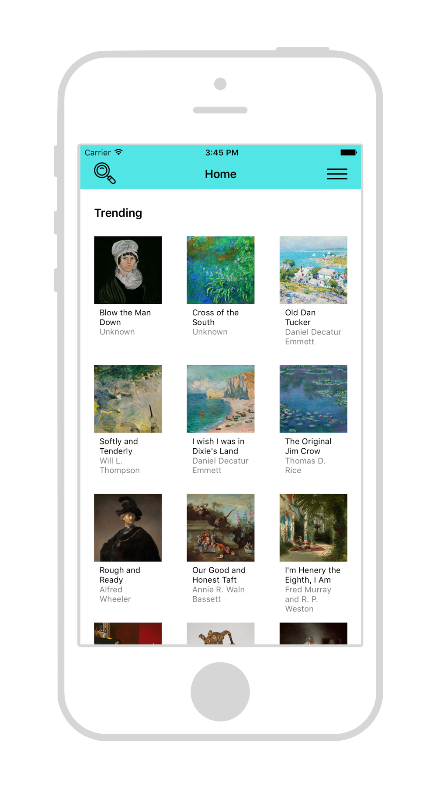
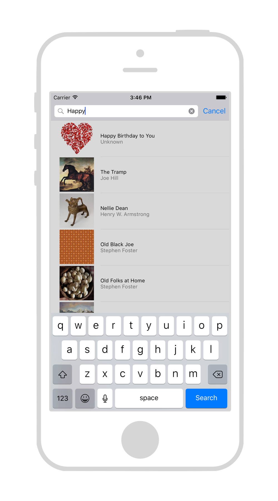
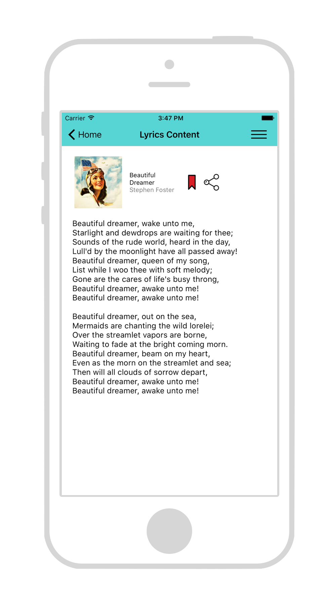

# LyricsFinder

Native iOS Demo App for exploring free public domain lyrics 
 
[Download now](https://dalosdev.github.io/LyricsFinder/Download.html) 
 
Features: 
- Email registration 
  - Create new account
  - Log in existing account
  - Log out
- Explore trending public domain lyrics 
- Search by Artist, song name, lyrics 
- Save your favourite lyrics 
- Share your favourite lyrics to your friends 
- User profile
- About
- Welcome walkthrough screenshot introduction when user enter the app for the 1st time
- Google Firebase integration 
  - Realtime database
  - Authetication
  - Analytics
 
Language: Swift
Device: iPhone  
Deployment Target: iOS 9.3+ 

--------------------------------------------------

Public Domain: The status of a published work or invention upon which the copyright or patent has expired or which has not been patented or subject to copyright. It may thus be freely used by the public.

All images and lyrics used in the app are in the public domain.

Credit: 
Comment white oval bubble free icon made by Dave Gandy from www.flaticon.com
  
Bookmark icon made by Lucy G from www.flaticon.com
  
Music player and User icon made by Madebyoliver from www.flaticon.com
  
Home, Information, Loupe and Share icon made by Freepik from www.flaticon.com  
All photo comes from https://www.flickr.com/creativecommons/cc0-1.0/ and is licensed by Public Domain Dedication (CC0)

